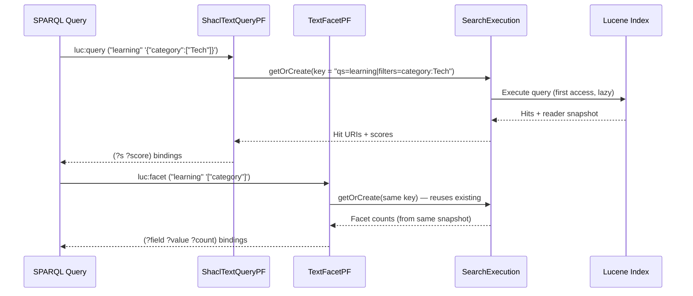
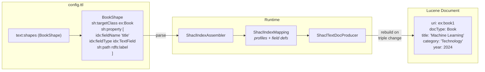

# Architecture

## Document Models

### Classic: Triple-Per-Document

The original `jena-text` model. Each RDF triple matching the entity map creates a separate Lucene document:

```
Triple: ex:book1 rdfs:label "Machine Learning"
  → Lucene doc: {uri: "ex:book1", text: "Machine Learning", lang: "en"}

Triple: ex:book1 ex:category "Technology"
  → Lucene doc: {uri: "ex:book1", category: "Technology"}
```

This is the upstream Jena text index, used with `text:entityMap` configuration and `text:query` for SPARQL search. No faceting support.

### SHACL: Entity-Per-Document

Introduced in Phase 2. Each entity (identified by `rdf:type` matching a shape's `sh:targetClass`) gets **one** Lucene document with all its fields:

```
Entity: ex:book1 (type ex:Book)
  → Lucene doc: {
      uri: "ex:book1",
      docType: "Book",
      title: "Machine Learning",
      category: "Technology",
      author: "Smith",
      year: 2024
    }
```

Used with `text:shapes` configuration. SPARQL search via `luc:query` (with filter support), facet counts via `luc:facet`.

**Advantages:**
- Single-pass faceting (text and facet fields on same document)
- Enables `DrillSideways` (future optimisation)
- Supports typed fields (int, long, double) for range queries
- Per-field configuration (stored, indexed, facetable, sortable)
- No overcounting from duplicate documents

---

## Key Classes

### Core (upstream, unmodified)

| Class | Role |
|-------|------|
| `TextQueryPF` | Implements `text:query` — upstream Jena text search property function |
| `EntityDefinition` | Maps RDF predicates to Lucene field names. Used by both modes |
| `TextIndexConfig` | Configuration holder passed to `TextIndexLucene` constructor |

### Core (extended)

| Class | Role |
|-------|------|
| `TextIndexLucene` | Central index implementation. Manages Lucene `IndexWriter`. Upstream methods unchanged; additive SHACL methods for faceting and entity document building |
| `Entity` | Represents a single indexable entity. `addValue()` supports multi-valued fields (additive) |

### SHACL Mode (all new files)

| Class | Role |
|-------|------|
| `ShaclIndexMapping` | Parsed data model: `IndexProfile` (shape), `FieldDef` (field), `FieldType` enum. Pure data, no RDF/Lucene dependencies beyond `Node` and `Analyzer` |
| `ShaclTextDocProducer` | Change listener. On triple add/delete, reads entity state from base dataset, builds Entity, calls `updateEntityForProfile()` |
| `ShaclTextQueryPF` | Implements `luc:query` — search with JSON filter support. Uses `SearchExecution` for shared state with `luc:facet` |
| `TextFacetPF` | Implements `luc:facet` — facet counts property function. Returns (field, value, count) bindings |
| `SearchExecution` | Shared execution state. Stored in `ExecutionContext` keyed by normalised query params. Lazy-computes hits and facet counts |
| `FacetValue` | Immutable (value, count) pair for facet results |
| `ShaclIndexAssembler` | Parses `text:shapes` RDF config into `ShaclIndexMapping`. Reads `sh:targetClass`, `sh:path`, `sh:alternativePath`. No jena-shacl dependency |
| `IndexVocab` | `urn:jena:lucene:index#` namespace constants and PF URI strings |

### Assembler (minimally extended)

| Class | Role |
|-------|------|
| `TextIndexLuceneAssembler` | Builds `TextIndexLucene` from TTL config. Additive: detects `text:shapes` alongside existing `text:entityMap` path |
| `TextDatasetAssembler` | Builds text-indexed dataset. Additive: auto-creates `ShaclTextDocProducer` in SHACL mode |

---

## Shared Execution Flow

When `luc:query` and `luc:facet` appear in the same SPARQL query:



Both PFs build a normalised key from query parameters. `SearchExecution.getOrCreate()` stores/retrieves shared state in `ExecutionContext`.

Key normalisation: property URIs are sorted, filter map keys are sorted, filter values within each key are sorted. This ensures the same logical query always produces the same key regardless of argument ordering.

---

## SHACL Change Listener Flow

`ShaclTextDocProducer` handles all triple changes. The base dataset is always up-to-date when `change()` fires because `DatasetGraphTextMonitor` calls `super.add()` before `record()`.

### Indexing flow from config to Lucene document



### Change listener detail

```
DatasetGraphTextMonitor.add(g, s, p, o)
  ├── super.add(g, s, p, o)        ← base dataset updated FIRST
  └── record() → change(ADD, g, s, p, o)
        │
        ShaclTextDocProducer.change()
        ├── p == rdf:type?
        │     └── handleTypeChange()
        │           └── rebuildEntityDocuments(s)
        ├── mapping.isRelevantPredicate(p)?
        │     └── rebuildEntityDocuments(s)
        └── else: ignore (irrelevant predicate)

rebuildEntityDocuments(subject)
  ├── Read rdf:type values from base dataset
  ├── Find matching IndexProfiles via classLookup
  ├── If no profiles match → deleteEntityByUri()
  └── For each matching profile:
        ├── Read all relevant triples from base dataset
        ├── Build Entity with addValue() for each field
        └── indexer.updateEntityForProfile(entity, profile)
              ├── docFromMapping() → builds typed Lucene Document
              ├── Delete existing doc by (uri + docType) composite query
              └── Add new document
```

---

## Lucene Field Mapping (SHACL Mode)

| FieldType | Lucene indexed field | Lucene stored field | Lucene DocValues |
|-----------|---------------------|--------------------|--------------------|
| TEXT | `TextField` | (via `TYPE_STORED`) | — |
| KEYWORD | `StringField` | (via `Store.YES`) | `SortedSetDocValuesFacetField` (facetable), `SortedDocValuesField` (sortable) |
| INT | `IntPoint` | `StoredField(int)` | `NumericDocValuesField` (sortable) |
| LONG | `LongPoint` | `StoredField(long)` | `NumericDocValuesField` (sortable) |
| DOUBLE | `DoublePoint` | `StoredField(double)` | `NumericDocValuesField` (sortable) |

Each entity document also gets:
- **URI field** (`ftIRI` type) — tokenized=false, stored=true
- **Discriminator field** — `StringField` with the target class local name (e.g., "Book")

---

## Performance Characteristics

### SortedSetDocValues Faceting

The SHACL mode uses Lucene's `SortedSetDocValuesFacetCounts` for facet counting:

- **O(1) counting** — uses pre-built DocValues structures, not document iteration
- **~25% more indexing time** compared to non-faceted fields (DocValues must be built at write time)
- **Memory overhead** — ~10-20 bytes per unique value per facetable field in the DocValues segment
- **High cardinality caution** — fields with very many unique values (e.g., URIs) can consume significant memory during facet collection. Use `text:maxFacetHits` to limit the search scope if needed.

### Best Practices

1. **Only enable faceting on fields you'll facet on** — set `idx:facetable true` selectively, not on every field
2. **Use `maxValues`** — don't request more facet values than the UI needs
3. **Use `minCount`** — exclude rare values to reduce result size
4. **Index rebuild required** — changing a field from non-facetable to facetable requires a full reindex since DocValues are built at write time
5. **`text:maxFacetHits`** — for large indexes, set this assembler property to cap the number of documents searched during facet collection. `0` (default) means unlimited.

### Entity Rebuild Cost

In SHACL mode, any relevant triple change triggers a full entity document rebuild. This reads all triples for the entity from the base dataset and replaces the Lucene document. For typical entities (< 50 triples), this is fast. For entities with hundreds of triples, this may be noticeable during high-frequency updates.

---

## Backward Compatibility

All changes are purely additive. The upstream Jena `jena-text` code paths are unmodified:

- `TextQueryPF` — upstream `text:query` implementation, unchanged
- `TextIndexLucene` core methods (`doc()`, `addDocument()`, `updateDocument()`) — unchanged
- `TextIndexLuceneAssembler` — `text:entityMap` path unchanged; `text:shapes` is an additive alternative
- `TextDatasetAssembler` — SHACL producer wiring only activates when `isShaclMode()` is true

New code lives in separate classes (`ShaclTextQueryPF`, `TextFacetPF`, `ShaclTextDocProducer`, etc.) and registers under the `luc:` namespace (`urn:jena:lucene:index#`), not the `text:` namespace.
