# Use Cases

Each feature is a building block. They can be used independently or combined to build richer search experiences. This page shows what each block does, with examples of where it applies.

---

## Completed Features

### Full-Text Search with Filters — `luc:query`

Search across entity fields using Lucene query syntax. Optionally narrow results with structured JSON filters that apply field-level constraints.

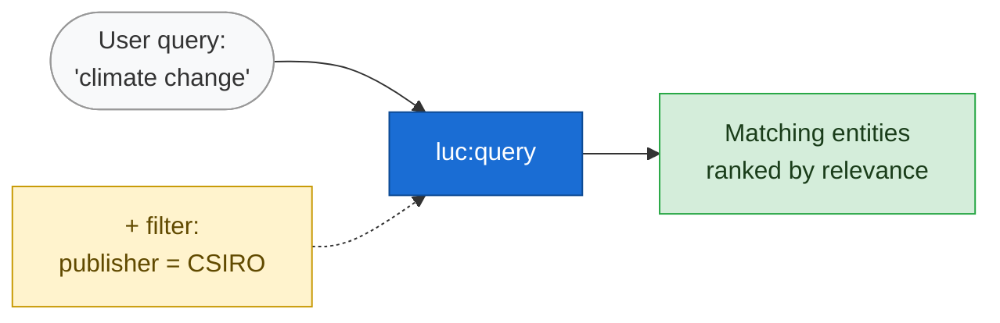

```sparql
# Simple search
(?s ?score) luc:query ("climate change") .

# Search narrowed to a publisher
(?s ?score) luc:query ("climate change" '{"publisher": ["CSIRO"]}') .

# Multiple filters (AND across fields, OR within a field)
(?s ?score) luc:query ("climate" '{"publisher": ["CSIRO", "BOM"], "category": ["Environment"]}') .
```

**Where this applies:**
- Search box in a data catalogue
- Keyword search in a document repository
- Filtered API endpoint for a knowledge graph

---

### Facet Counts — `luc:facet`

Get value counts for one or more fields across the result set. Shows how results distribute across categories, publishers, types, etc.

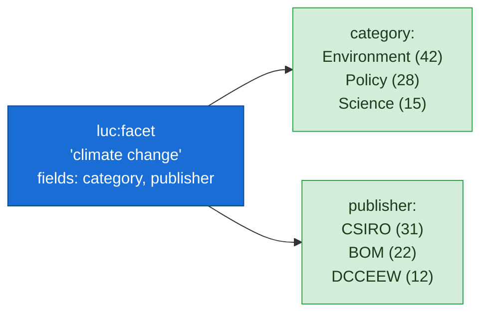

```sparql
# Counts for category and publisher, top 10 values each
(?field ?value ?count) luc:facet ("climate change" '["category", "publisher"]' 10) .

# With minCount — only values with 5+ results
(?field ?value ?count) luc:facet ("climate change" '["category"]' 10 5) .
```

**Where this applies:**
- Sidebar facet panels in a search UI
- Summary statistics for a dataset collection
- "Browse by" navigation (by theme, by organisation, by type)

---

### Search + Facets Together — Recommended Patterns

Search hits and facet counts are different result shapes. Hits are entities with scores; facets are (field, value, count) aggregations. Care is needed to avoid a cartesian product when combining them.

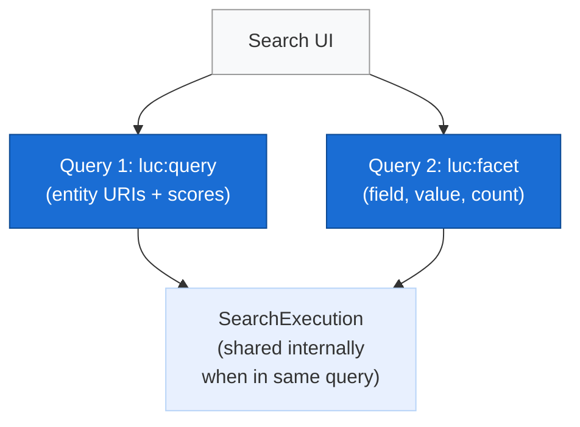

```sparql
# Recommended: separate queries, clean result shapes
# Query 1 — hits
SELECT ?s ?score WHERE {
    (?s ?score) luc:query ("climate change") .
}

# Query 2 — facets
SELECT ?field ?value ?count WHERE {
    (?field ?value ?count) luc:facet ("climate change" '["category", "publisher"]' 10) .
}

# Alternative: single query via UNION (N+M rows, no cartesian product)
SELECT ?s ?score ?field ?value ?count WHERE {
    { (?s ?score) luc:query ("climate change") . }
    UNION
    { (?field ?value ?count) luc:facet ("climate change" '["category", "publisher"]' 10) . }
}
```

**Where this applies:**
- Any search page that shows results and facet counts together
- Matches the pattern used by Elasticsearch and Solr — one request for hits, one for facets
- UNION alternative when a single SPARQL request is required

---

### Automatic Index Maintenance — Change Listener

When triples are added or removed from the RDF dataset, the Lucene index updates automatically. No manual reindexing or sync jobs required.

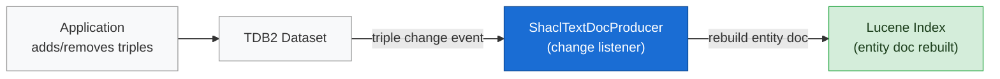

**Where this applies:**
- Live data feeds — index stays current without batch jobs
- Editorial workflows — changes are searchable immediately
- Replaces custom ETL pipelines that sync data to a separate search engine

---

### Entity-Per-Document Indexing — SHACL Shapes

Each entity (e.g. a Book, a Dataset, a Person) becomes a single Lucene document with all its fields. SHACL shapes define what gets indexed and how.

```mermaid
flowchart LR
    subgraph RDF["RDF Triples"]
        t1["ex:book1 rdf:type ex:Book"]
        t2["ex:book1 rdfs:label 'Machine Learning'"]
        t3["ex:book1 ex:category 'Technology'"]
        t4["ex:book1 ex:year 2024"]
    end

    subgraph Doc["Lucene Document"]
        d1["uri: ex:book1"]
        d2["docType: Book"]
        d3["title: 'Machine Learning' (TEXT)"]
        d4["category: 'Technology' (KEYWORD)"]
        d5["year: 2024 (INT)"]
    end

    RDF -- "SHACL shape<br/>defines mapping" --> Doc

    style RDF fill:#f8f9fa,stroke:#999,color:#333
    style Doc fill:#d4edda,stroke:#28a745,color:#1a3d1a
```

Field types control how each value is indexed:

| Type | Searchable | Facetable | Range queries | Example |
|------|-----------|-----------|---------------|---------|
| TEXT | Full-text | No | No | Title, description, abstract |
| KEYWORD | Exact match | Yes | No | Category, publisher, status |
| INT / LONG | No | No | Yes | Year, count, size |
| DOUBLE | No | No | Yes | Score, latitude, price |

**Where this applies:**
- Any RDF dataset where entities have typed properties
- Replaces the need for a separate search schema — SHACL shapes serve as both data model and index definition

---

## Proposed Features

### Inverse and Sequence Paths

Extends `sh:path` support · No breaking changes

Currently only direct properties (`sh:path <uri>`) and alternatives (`sh:alternativePath`) can be indexed. This limits what data reaches the index without denormalising the RDF. Path extensions let the index follow relationships.

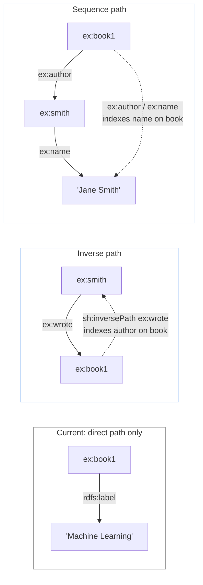

**Where this applies:**
- Index an author's name directly on a book (sequence path: `ex:author / ex:name`) — avoids needing a denormalised `ex:authorName` property
- Index incoming references (inverse path: `sh:inversePath ex:memberOf`) — find an organisation by searching its members' names
- Index labels of linked entities — a dataset's theme label, a product's manufacturer name

---

### Spatial Filtering — Bounding Box

Extends filter argument · No breaking changes

Restrict search results and facet counts to entities within a geographic bounding box.

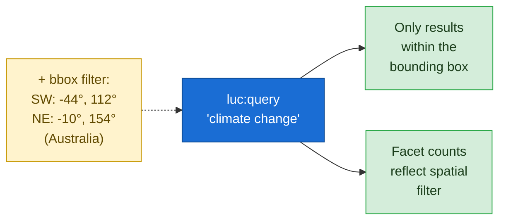

**Where this applies:**
- Map-based data discovery (draw a region, see what's there)
- Geospatial catalogues (environmental data, infrastructure, land use)
- Location-scoped search (find datasets near a city or within a jurisdiction)

---

### DrillSideways — Smarter Facet Counting

Opt-in on `luc:facet` · No breaking changes · Deferrable

Standard faceted search UX. When a user filters by `category = Environment`, the category facet still shows counts for *all* categories — so the user can see what else is available and switch. Other facets (publisher, year) narrow as expected.

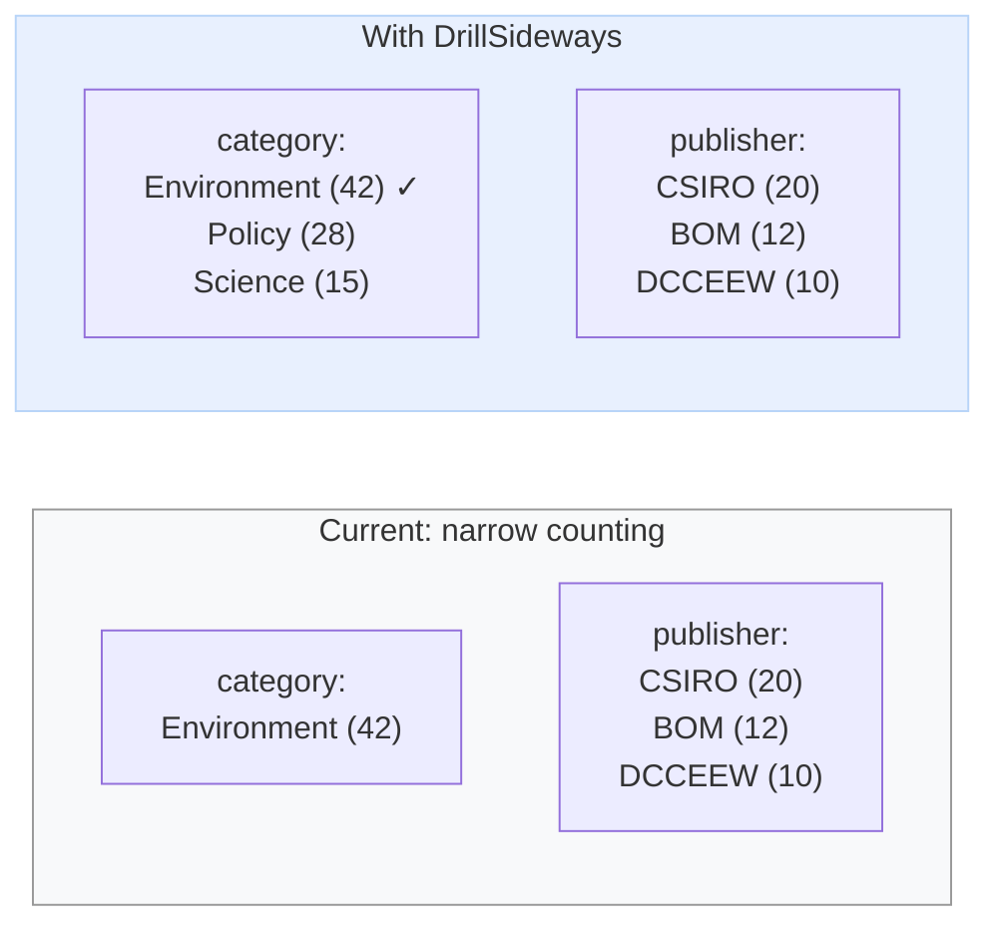

**Where this applies:**
- E-commerce product filtering (Amazon, eBay pattern)
- Library catalogue browsing
- Any UI where users iteratively refine search by selecting facets

---

### Hierarchical Facets — Taxonomy Drill-Down

Extends `luc:facet` · No breaking changes · Deferrable

Navigate taxonomy trees as facets. Values become paths rather than flat strings.

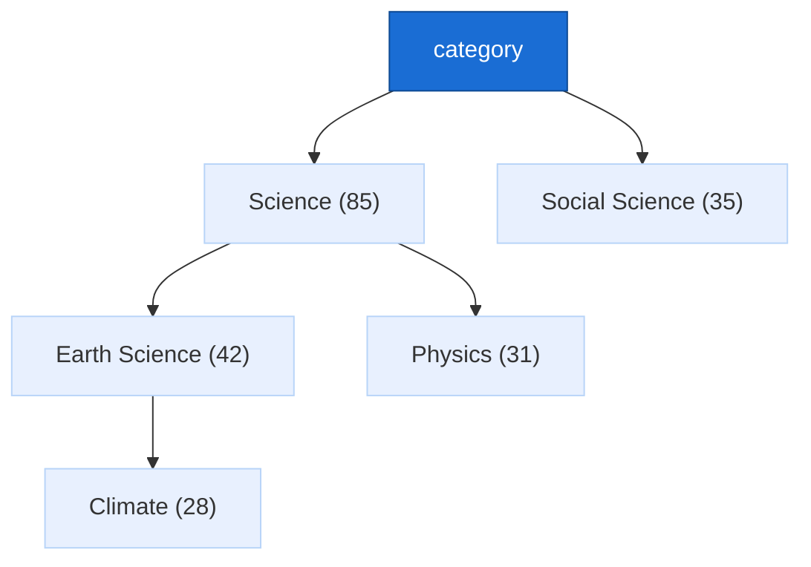

**Where this applies:**
- Subject classification systems (ANZSRC, DDC, LCSH)
- Product category trees (electronics > phones > smartphones)
- Organisational hierarchies (department > division > team)

---

### Range Facets — Numeric Buckets

New PF `luc:facetRange` · No breaking changes · Deferrable

Group numeric or date values into ranges and return counts per range.

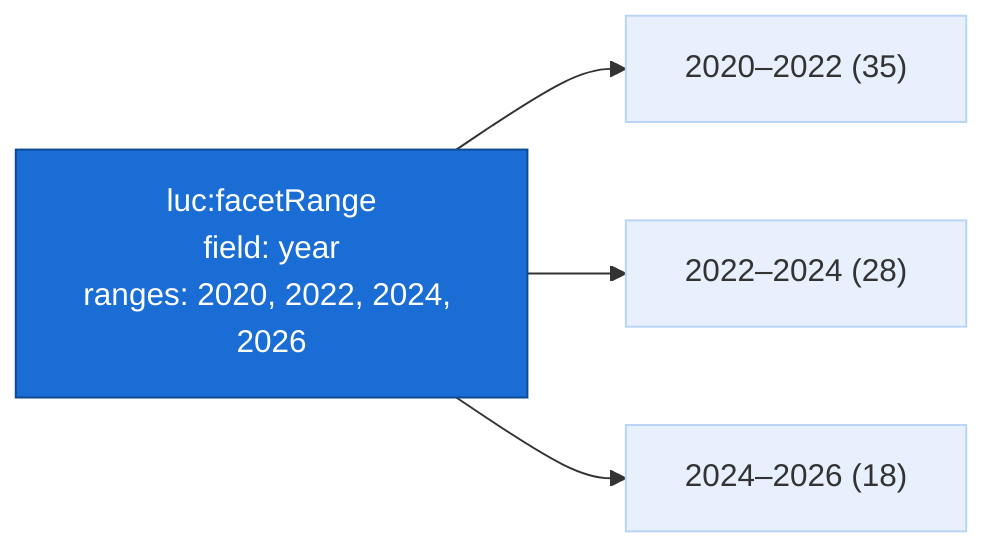

**Where this applies:**
- Year/date filtering (publications, events, records)
- Price bands (products, grants, budgets)
- Size or quantity ranges (file size, population, area)

---

### Result Grouping

New PF `luc:group` · No breaking changes · Deferrable

Group search results by a field value instead of returning a flat list.

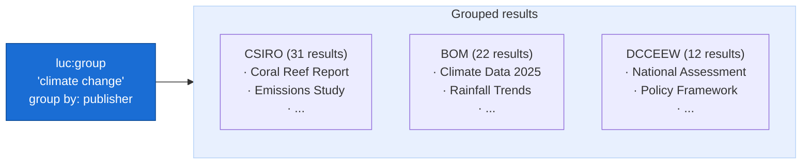

**Where this applies:**
- "Results by publisher" or "results by category" view
- Email-style threading (group by conversation)
- Grouped search results (like Google's site-grouped results)

---

### Suggest / Autocomplete

New PF `luc:suggest` · No breaking changes · Deferrable

Type-ahead completions as the user types, backed by Lucene's suggester infrastructure.

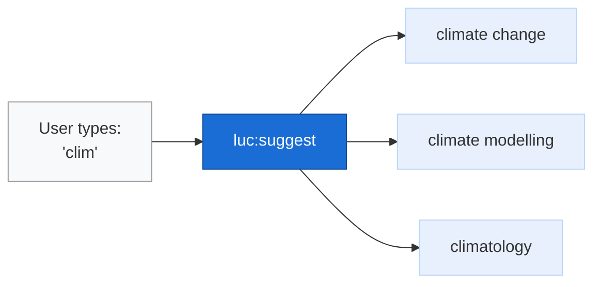

**Where this applies:**
- Search box type-ahead in any portal
- Entity name completion in data entry forms
- Quick navigation to known items

---

## How They Combine

These building blocks compose naturally. A single application can use any combination:

| Application | Search | Facets | Filters | Paths | Spatial | DrillSideways | Ranges | Hierarchical | Grouping | Suggest |
|-------------|--------|--------|---------|-------|---------|---------------|--------|--------------|----------|---------|
| Data catalogue | x | x | x | x | x | x | x | | | x |
| Geospatial portal | x | x | x | | x | | | | | |
| Research repository | x | x | x | x | | x | x | x | | x |
| Museum catalogue | x | x | x | x | | | x | | x | x |
| Corporate knowledge graph | x | x | x | x | | x | | | x | x |
| Simple search page | x | | | | | | | | | |

Each "x" is a feature block added to the SPARQL query. No custom backend code — the application constructs SPARQL and sends it to Fuseki.
