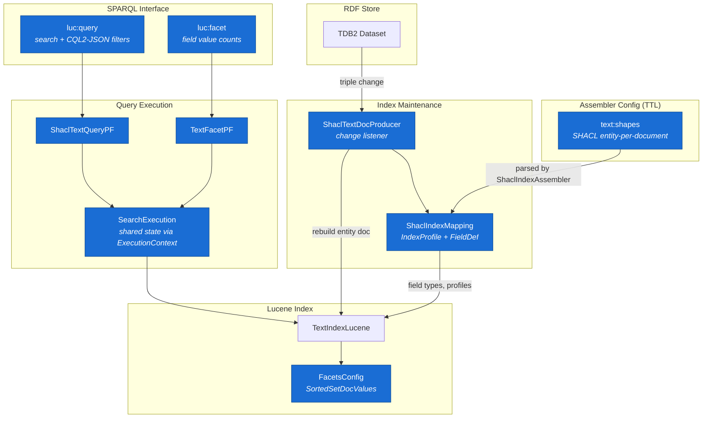
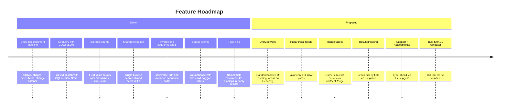

# Jena Text Index: Faceting & Entity-Per-Document

This documentation covers the faceted search and entity-per-document indexing features added to Apache Jena's `jena-text` module.

## Feature Overview

### Feature Status

| Feature | Status | SPARQL | Description |
|---------|--------|--------|-------------|
| Entity-per-document indexing | Done | — | SHACL shapes define entity types with typed fields (TEXT, KEYWORD, INT, LONG, DOUBLE, LATLON) |
| Text search with filters | Done | `luc:query` | Full-text search with CQL2-JSON structured filters |
| Facet counts | Done | `luc:facet` | Field value counts with maxValues, minCount controls |
| Shared execution | Done | — | `luc:query` + `luc:facet` share a single Lucene search when co-occurring |
| Automatic index maintenance | Done | — | Change listener rebuilds entity docs on triple add/delete |
| Inverse and sequence paths | Done | — | `sh:inversePath` and multi-hop sequence paths for cross-entity indexing |
| Spatial filtering | Done | `luc:query`/`luc:facet` | Bounding-box and polygon filter via LatLonShape. See [Spatial Filtering](09-spatial.md) |
| Field IRIs | Done | `luc:query`/`luc:facet` | Named field resources preserve their IRI; `?field` bindings return IRIs |
| DrillSideways | Proposed | `luc:facet` | Filtered dimension still shows all values (standard faceted UI pattern) |
| Hierarchical facets | Proposed | `luc:facet` | Taxonomy drill-down (Science > Physics > Quantum) |
| Range facets | Proposed | `luc:facetRange` | Bucket counts over numeric ranges (year bands, price tiers) |
| Result grouping | Proposed | `luc:group` | Group search hits by field value |
| Suggest / Autocomplete | Proposed | `luc:suggest` | Type-ahead completions via Lucene suggesters |
| Bulk SHACL reindexer | Proposed | — | CLI tool for full reindex using SHACL shapes |

All proposed extensions are additive — no breaking changes to existing query or response models.

Public API rule: external field references are always IRIs in `luc:query`, `luc:facet`, CQL filter `property` entries, sort specs, and returned `?field` bindings. Internal Lucene field names from `idx:fieldName` remain implementation details, except for the special `"default"` fieldSpec shorthand and ordinary Lucene query strings supplied as search text.

### Component Architecture (current implementation)



See [Architecture](04-architecture.md) for detailed query flow and indexing flow diagrams. The upstream Jena `text:query` / `text:entityMap` (classic mode) is unchanged and still available but not shown here.

### Roadmap



All proposed extensions are additive — no breaking changes to existing query or response models. See [Use Cases](08-use-cases.md) for how these features combine in a real application.

## Documents

| Document | Audience | Description |
|----------|----------|-------------|
| [User Guide](01-user-guide.md) | Users / Integrators | Configure, query, deploy with Fuseki, troubleshoot |
| [SPARQL API Reference](02-sparql-api.md) | Users / Developers | `text:query`, `luc:query`, `luc:facet` syntax, Lucene query syntax, Java API |
| [Configuration Reference](03-configuration.md) | Admins / Integrators | Assembler TTL config for both indexing modes |
| [Architecture](04-architecture.md) | Developers | Internal design, document models, shared execution |
| [Testing](05-testing.md) | Developers / QA | Test coverage, how to run tests |
| [Design Decisions](06-design-decisions.md) | Developers / Reviewers | Why things are the way they are |
| [Known Limitations & Future Work](07-future-work.md) | All | What's deferred, what needs attention |
| [Use Cases](08-use-cases.md) | All / Business | Search portal example showing how features combine |
| [Spatial Filtering](09-spatial.md) | Users / Developers | LatLonShape indexing, CQL2-JSON spatial queries |

## Quick Start

```turtle
# Entity-per-document indexing with SHACL shapes
text:shapes ( <#BookShape> ) ;
```

```sparql
PREFIX luc: <urn:jena:lucene:index#>

# Search
(?s ?sc) luc:query ("machine learning") .

# Facet counts (field IRIs in the JSON array)
(?f ?v ?c) luc:facet ("default" "machine learning"
    '["urn:jena:lucene:field#category"]' 10) .

# Search with CQL2-JSON filter (field IRI as property)
(?s ?sc) luc:query ("default" "learning"
    '{"op":"=","args":[{"property":"urn:jena:lucene:field#category"},"Technology"]}' 20) .
```

## Build & Test

```bash
mvn test -pl jena-text                    # 366 tests
mvn clean install -pl jena-fuseki2/jena-fuseki-server -am -DskipTests  # build Fuseki
```

## Archive

Previous working documents, design reviews, and phase summaries are in [archive/](archive/).

## What Changed

Summary of additions to the upstream Apache Jena codebase as part of this work.

### Java Source (`jena-text/src/main/java`) — 16 files, +2,594 lines

**9 new classes:**

| Class | Lines | Role |
|-------|-------|------|
| `TextIndexLucene` (extended) | +646 | SHACL faceting methods added to central index |
| `ShaclTextQueryPF` | +340 | `luc:query` property function with JSON filter support |
| `TextFacetPF` | +354 | `luc:facet` property function for facet counts |
| `ShaclIndexAssembler` | +303 | Parses `text:shapes` RDF config into `ShaclIndexMapping` |
| `ShaclTextDocProducer` | +191 | Change listener — rebuilds entity Lucene docs on triple changes |
| `SearchExecution` | +188 | Shared execution state between `luc:query` and `luc:facet` |
| `ShaclIndexMapping` | +186 | Data model: `IndexProfile`, `FieldDef`, `FieldType` enum |
| `FacetedTextResults` | +106 | Result container for faceted search |
| `FacetValue` | +73 | Immutable (value, count) pair |
| `IndexVocab` | +67 | `urn:jena:lucene:index#` namespace constants |

**7 modified classes** (additive only): `TextIndexConfig`, `Entity`, `TextQuery`, `TextVocab`, `TextDatasetAssembler`, `TextIndexLuceneAssembler`, `TextVocab`

### Java Tests (`jena-text/src/test/java`) — 12 new files, +2,329 lines

| Test Class | Tests | Coverage |
|------------|-------|----------|
| `TestTextFacetPF` | 7 | SPARQL `luc:facet` property function |
| `TestNativeFacetCounts` | 10 | Java API facet operations |
| `TestShaclEntityPerDocument` | 7 | End-to-end text search and facets |
| `TestTextQueryPFFilters` | 6 | `luc:query` with JSON filters |
| `TestShaclDocumentBuilding` | 11 | Lucene doc building, all field types |
| `TestShaclTextDocProducer` | 5 | Change listener lifecycle |
| `TestShaclIndexMapping` | 8 | Data model, predicate/class lookup |
| `TestSearchExecution` | 6 | Shared execution key normalisation |
| `TestShaclAssembler` | 3 | Config parsing |
| `TestFacetedResults` | — | Faceted result container |
| `TestUpdateDocumentFacets` | — | Document update with facets |
| `TS_Text` (modified) | — | Suite registration for new tests |

### Documentation (`docs/`) — 25 new files, +5,373 lines

8 core docs (user guide, SPARQL API, configuration, architecture, testing, design decisions, future work) and 17 archive documents (design specs, review notes, phase summaries).

### Totals

| | Files | Lines |
|---|---|---|
| Java source | 16 (9 new, 7 modified) | +2,594 |
| Java tests | 12 (all new) | +2,329 |
| Documentation | 25 (all new) | +5,373 |
| **Total** | **54** | **+10,299** |
