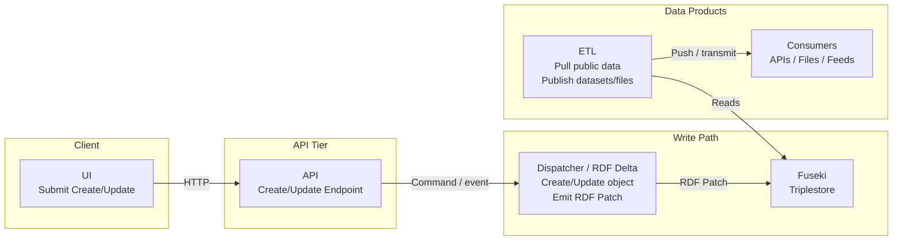
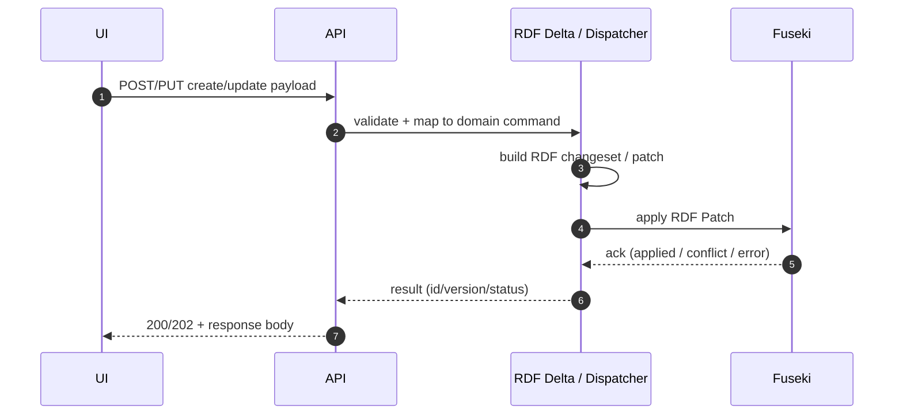
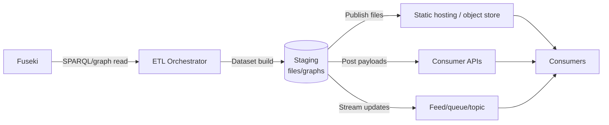

Yep — a **high-level “system context” diagram + a couple of mini sequence/flow diagrams** is usually the sweet spot. The big one answers “what are the boxes and how do they connect?”, and the minis answer “what actually happens for create/update vs ETL distribution?”.

Below is a clean set you can drop into docs (Mermaid).

## Diagram 1 — System overview (containers + main data paths)



## Diagram 2 — Create/Update request flow (sequence)



**Notes you may want to reflect in labels (optional):**

* If the write path is async, have API return **202 Accepted** with a job id, and UI polls / subscribes.
* If you care about optimistic concurrency, show **ETag/version** coming from Fuseki or derived state.

## Diagram 3 — RDF Delta as an internal pattern (event-sourced-ish patch log)

This illustrates *why* the dispatcher exists (append-only patches, replay, downstream subscribers, etc.).

```mermaid
flowchart TB
  API[API Command] --> D[Dispatcher\nNormalise + Authorise\nCreate RDF Patch]

  D --> L[(RDF Patch Log / Stream\nRDF Delta)]
  L --> F[Fuseki\nMaterialised store]
  L --> S[Other subscribers\n(optional)]
  S --> X[Validation / indexing / cache\n(optional)]
```

If you don’t actually have a patch log/stream and it’s purely “dispatcher generates patch then posts to Fuseki”, remove the log box and keep it as a simple write adapter.

## Diagram 4 — ETL publication + distribution modes

This one is handy because ETL “to consumers” can mean different mechanisms (push files, post to APIs, publish to a bucket, etc.).



## Is it sensible to have mini diagrams?

Yes — very. A practical doc set is:

* **1x Overview container diagram** (Diagram 1)
* **1x Sequence diagram per major use case**

  * Create/Update write path (Diagram 2)
  * Optional: Read/query path (UI → API → Fuseki)
* **1x “pattern” diagram** for anything non-obvious

  * RDF Delta / patch-log / dispatcher responsibility split (Diagram 3)
* **1x Distribution diagram** for ETL consumer delivery (Diagram 4)

If you want, I can also add a **read/query** mini diagram (often clarifies that writes go via dispatcher but reads can go direct to Fuseki or via API).
