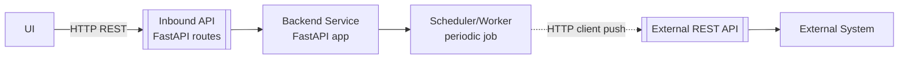
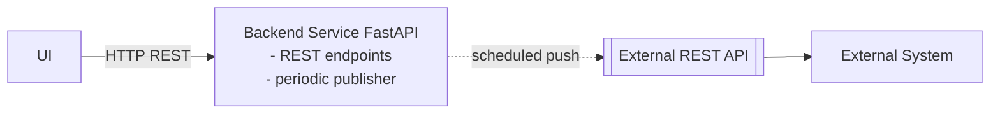

Got it. In that case, it’s the **same deployed service** playing two roles:

1. **Inbound REST API** (FastAPI endpoints you expose)
2. **Outbound “publisher” job** (periodic push/update to other systems)

On diagrams, represent that as **one service** with two labelled “ports”/responsibilities, rather than two separate services.

## Pattern A — One service, two roles (recommended)

**Conventions here:**

* `Inbound API` is a *contract/port*.
* `Scheduler/Worker` is *internal execution mode* (cron/beat/async task).
* Outbound edge is dashed and labelled `HTTP client push`.

## Pattern B — Same service, but show the “job” as a component inside it

If you prefer fewer boxes:

This is clean for high-level docs; less precise about how scheduling is done.

## What to call the periodic bit (pick one label and stick to it)

Use a label that matches reality:

* **In-process scheduler**: `Cron`, `APScheduler`, `Celery beat`, `K8s CronJob`, etc.
* **Background worker**: `Celery worker`, `RQ`, `Arq`, etc.
* **Timer-triggered function**: if it’s not actually in the same container.

Even if it *shares code*, it’s still worth diagramming as a separate execution path if it has different failure/retry/throughput characteristics.

## Practical rule for your diagrams

* **Same codebase + same deployable** ⇒ **one service box**
* Different interaction types ⇒ **different ports / edge styles**

  * Solid `HTTP (REST)` for inbound
  * Dashed `HTTP client (push)` for outbound periodic work
  * Dotted for async/event/patch (e.g., RDF Delta)

If you tell me how the periodic push is triggered (K8s CronJob vs Celery beat vs in-app scheduler), I’ll rewrite the diagrams with the correct “scheduler” box and semantics (retries, idempotency, etc.).
